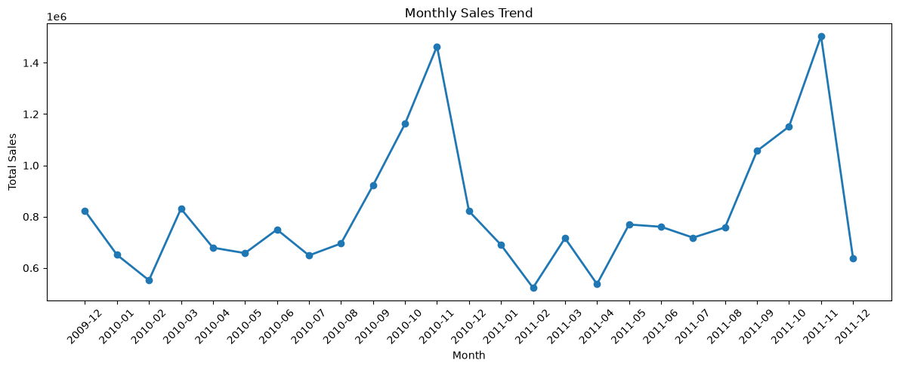
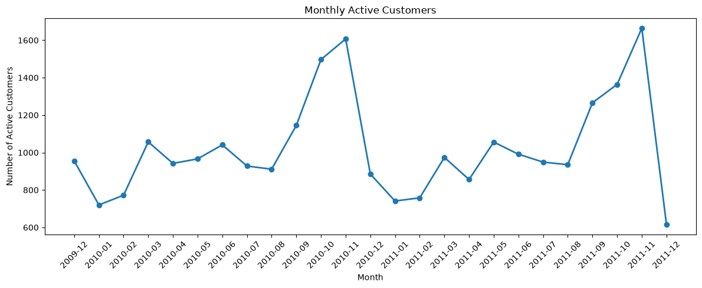
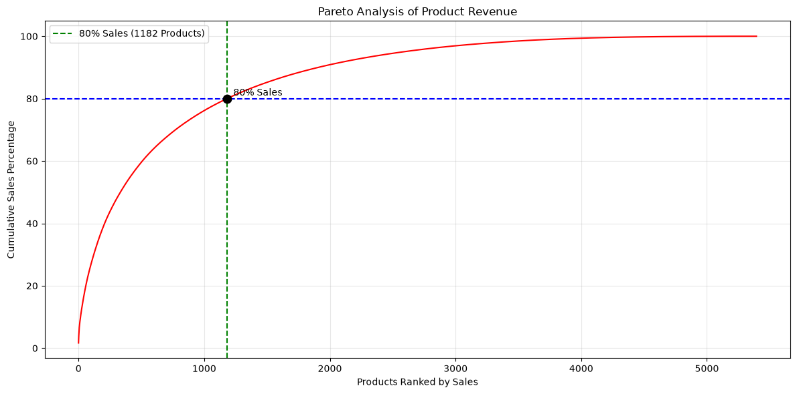

# E-commerce Customer Sales Analysis

Business-driven customer analytics project using Python and RFM analysis to uncover customer behavior, sales trends, and actionable business insights.

**Capstone Project for Google Data Analytics Professional Certificate**

## 🛠 Tech Stack

Python • Pandas • NumPy • Matplotlib • Seaborn • Jupyter Notebook • Git • GitHub

## 📊 Analytics Skills 

Data Cleaning • Exploratory Data Analysis (EDA) • RFM Customer Segmentation • Customer Analytics • Business Intelligence • Data Visualization 

## 🔄 Project Workflow 
Dataset

↓

Data Quality Assessment

↓

Data Cleaning

↓

Exploratory Data Analysis

↓

RFM Customer Segmentation

↓

Business Recommendations


## 📌 Project Overview 

This project analyzes customer purchasing behavior and sales performance using the Online Retail II dataset. 

The objective is to identify purchasing patterns, evaluate sales trends, and generate actionable business insights that support revenue growth and improve customer retention.

## 🎯 Business Objective 

The primary objective of this project is to analyze customer purchasing behavior and sales performance to identify opportunities for increasing revenue and improving customer retention. 

The analysis aims to support data-driven business decision-making through meaningful insights derived from transaction data.

## ❓ Business Questions

This project seeks to answer the following business questions:

- Which products generate the highest revenue?
- Which customers contribute the most sales?
- How do sales change over time?
- Which countries generate the highest revenue?
- What purchasing patterns can improve customer retention?


## Project Summary

| Metric | Value|
|--------|------|
|Dataset| Onlie RetailⅡ|
|Analysis Period| Dec 2009 - Dec 2011|
|Original Transactions| 1,067,371|
|Transactions After Cleaning | 1,028,001|
|Customers Analyzed|5,878|
|Countries|43|

## 📂 Dataset Overview

This project uses the **Online Retail II** dataset, which contains transactional records from a UK-based online retail company.

The dataset includes customer purchases made between **December 2009 and December 2011**, making it suitable for sales trend analysis, customer segmentation, and purchasing behavior analysis.

### Source

- **Dataset:** Online RetailⅡ
- **Provider:** UCI Machine Learning Repository 
- **Access:** Kaggle
- **Link:** https://www.kaggle.com/datasets/mashlyn/online-retail-ii-uci

### Key Variables

| Column | Description |
|---------|-------------|
| Invoice | Invoice number |
| InvoiceDate | Transaction date |
| Customer ID | Unique customer identifier |
| StockCode | Product code |
| Description | Product description |
| Quantity | Quantity purchased |
| Price | Unit price |
| Country | Customer country |

### Data Cleaning Summary 

The following processing steps were applied before analysis:

- Removed duplicate records
- Removed cancelled transactions (Invoice starting with "C")
- Removed transactions with non-positive quantities
- Removed transactions with non-positive unit prices
- Converted InvoiceDate to datetime format
- Created Total Sales feature (Quantity * Price)

### Data Files

```text
data/
├── raw/
│   └── (download from Kaggle)
└── processed/
    └── online_retail_cleaned.csv
```

> The raw dataset is not included in this repository due to file size limitations. 
> Please download it from the Kaggle link above.

## 📊 Exploratory Data Analysis

### 1. Sales Performance

** Analysis Purpose**

Examine monthly revenue, order volume, and average order value to identify sales trends trends and seasonal patterns.



**Key Findings**

- Sales increased over the analysis period, with noticeable seasonal fluctuations.
- Revenue peaked during the year-end holiday season.
- Revenue and order volume generally moved in the same direction.

**Business Implication**

Seasonal demand patterns can support inventory planning, promotional timing, and resource allocation.

### 2. Customer Activity

**Analysis Purpose**

Track monthly active customers to understand changes in customer participation over time.



**Key Findings**

- Active customer counts fluctuated across the analysis period.
- Customer activity increased during high-sales months.
- Higher customer participation generally concluded with stronger revenue performance.

**Business Implication**

Monitoring active customers can help evaluate acquisition, engagement, and seasonal campaign performance. 

### 3. Geographic Analysis

**Analysis Purpose**

Compare sales performance across countries and identify major international markets.


Sales performance was compared across different countries to identify major international markets.

**Key Findings**

- The dataset contains transactions from 42 countires.
- The United Kingdom generated the dominat share of total revenue.
- The visualization focuses on the top 10 countires to improve readability and hightlight the strongest markets.
- The visualization focuses on the top 10 countries to provide a clearer comparision of international markets.
- Several non-UK European markets showed meaningful sales potential.

**Business Implication**

Country-level performance can guide market prioritization, localized campaigns, and international expansion decisions.

### 4. Product Analysis

**Analysis Purpose**

Evaluate product performance using revenue, quantity sold, and cumulative sales contribution.



Product performance was evaluated using sales revenue, purchasing quantity, and cumulative contribution.

**Key Findings**

- A small number of products generated a large share of total revenue.
- Product demand was highly concentrated.
- Pareto analysis confirmed that a limited number of products contributed most of the sales. 

### EDA Summary

The exploratory analysis identified strong seasonality, geographic concentration, differences in customer activity, and uneven product contribution. These findings provide the foundation for the next stage of the project: segmenting customer according to their purchasing behavior and value.


### License

This dataset is distributed through Kaggle for educational and research purposes. Please refer to the dataset page for the latest licensing and usage terms.


